# Ek Tap

**12 one-button games in one Android app.** *Ek tap* is Urdu for "one tap": every game here is played with a single finger. You either hold and release, or tap.

Built in **Godot 4.7** with no image assets. Every sprite is drawn in code and every sound is synthesized at runtime. Several games take their flavour from Pakistan: chai at a roadside dhaba, Basant kites, kabaddi, a tawa roti, bazaar haggling and a busy chowk.

<p align="center">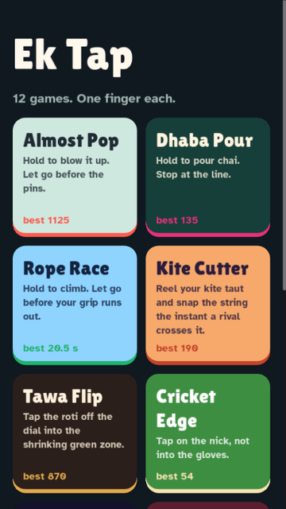</p>

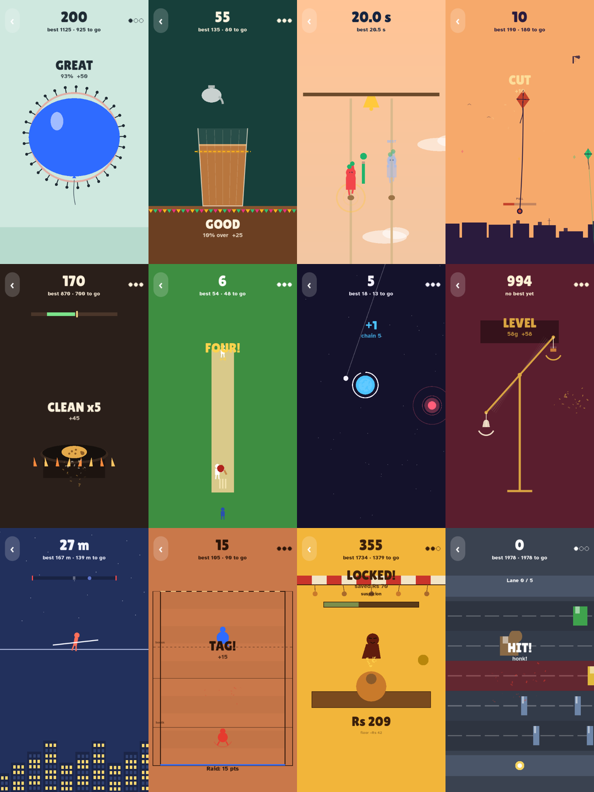

**Download:** the latest APK is on the [Releases page](../../releases).

## The games

| | Game | Input | You... |
|---|---|---|---|
| 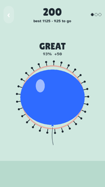 | **Almost Pop** | hold / release | blow up a balloon inside a ring of pins and let go before it touches |
| 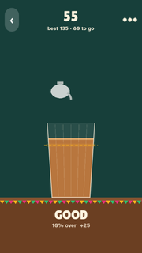 | **Dhaba Pour** | hold / release | pour chai to a chalk line (tea still in the air lands after you let go) |
| 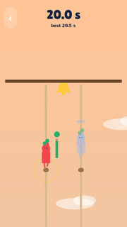 | **Rope Race** | hold / release | climb a rope, rest before your grip runs out, and race your best ghost |
| 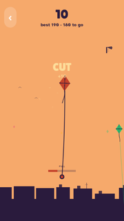 | **Kite Cutter** | hold / release | pull your kite string tight and snap it the moment a rival kite crosses |
| 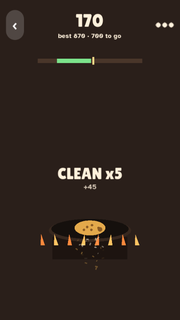 | **Tawa Flip** | tap | flip a roti off the charge dial so it lands flat in the shrinking zone |
| 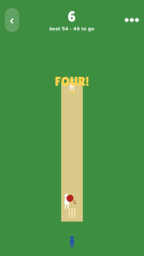 | **Cricket Edge** | tap | time the swing: early for a big shot, on the edge for safe runs |
| 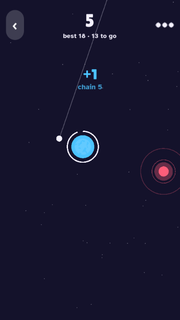 | **Orbit Sling** | hold / release | whip a stone around a planet and sling it to the next one |
| 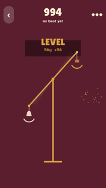 | **Scale Call** | hold / release | load a brass scale and let go before it looks level (it keeps swinging) |
| 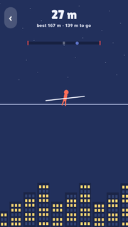 | **Wire Walker** | tap | flip your balance pole, but only when the wind really needs it |
| 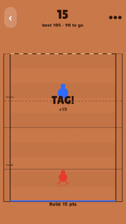 | **Kabaddi Raid** | hold / release | raid deep, tag defenders, and get home before they catch you |
| 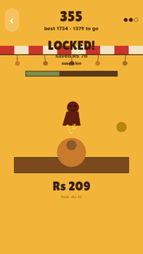 | **Bazaar Bell** | hold / release | haggle the price down and lock it in before the shopkeeper catches on |
| 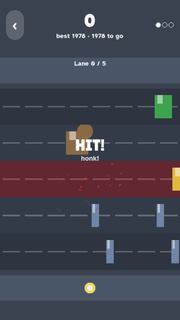 | **Chowk Crossing** | tap | step across a busy intersection between rickshaws, bikes and a cow |

## How it was designed

1. **Research → skill.** Six research agents studied what makes games replayable, popular and "addictive" (and where that becomes manipulation). The result became a design-audit skill (`game-retention-design`). It works through gates in order: the toy, decisions and mastery, reasons to come back, respect, and spread.
2. **Ideas gauntlet.** Three agents proposed 24 one-button concepts. A separate harsh critic compared each one blind against the real hit it most resembles (Flappy Bird, Stack, Stick Hero, Crossy Road…) and kept 9.
3. **Skill pass.** The 9 specs went through the skill. Anything that needed a second input was cut. Each game has a readable failure (a freeze on the cause within about 1 s), no jargon, instant restart and a real risk/reward choice every round.
4. **Build + critic loop.** Builder agents wrote each game against a shared `MiniGame` base. Fresh critic agents then judged real autoplay footage and named each game's biggest gap. Games were fixed and re-judged.

## Project layout

```
core/mini_game.gd   base class: input (touch/mouse/Space), score, lives, best, shake, hit-stop, popups, particles, autoplay
core/hud.gd         shared HUD + game-over card
core/save.gd        best scores in user://save.cfg
core/sfx.gd         tiny synth (tones, noise, loops) rendered to AudioStreamWAV
games/*.gd          one file per game, all code-drawn
main.gd             the game picker
```

Adding a game means one new file: `extends MiniGame`, override `_setup / _tick / _draw_game / _on_press / _on_release / _bot`, then add its path to `GAMES` in `main.gd`.

## Run it

```bash
godot --path .                                   # desktop, opens the menu
godot --path . -- --game=kite_cutter              # jump straight into a game
godot --path . -- --game=kite_cutter --autoplay   # watch the bot play it
```

Build the Android APK (needs the Android SDK, JDK 17 and Godot 4.7.2 export templates):

```bash
godot --headless --path . --export-debug "Android" build/ek-tap.apk
adb install -r build/ek-tap.apk
```

The APK contains arm64 (phones) and x86_64 (emulators). Tested on the Android emulator with the Vulkan mobile renderer. Devices without Vulkan fall back to OpenGL ES 3. A very weak GPU (for example the emulator's software-only SwiftShader OpenGL mode) can fail to compile Godot's 2D shader and show a blank screen.

## Status

- All 12 games run without script errors in headless autoplay and reach game over.
- Bests are saved per game on the device.
- Not yet: a daily-seed mode, the online multiplayer from the web version of Rope Race, and real-phone playtests.

MIT licensed. Fonts: Lilita One and Atkinson Hyperlegible (SIL Open Font License).
